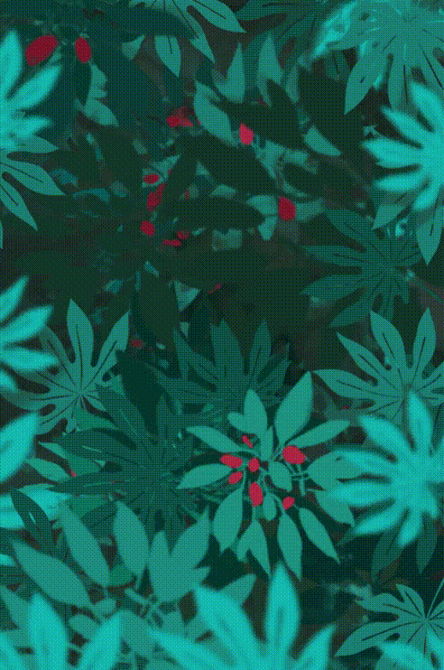

# @liaoys/parallax

A JavaScript library that makes parallax animations for a website.It effects for any elements and any css style that has number value.

example1


---

example2



---

See [example](https://liaoyuesheng.github.io/parallax/)

## Installation
```
npm install @liaoys/parallax
```
## Usage

```html
<div id="parallax-container">
    <div class="parallax-element"
         parallax-start-style="transform: translate(0,0)"
         parallax-end-style="transform: translate(100px,0)"
    >element1</div>
    <div class="parallax-element"
         parallax-start-style="transform: translate(0,0)"
         parallax-end-style="transform: translate(-100px,0)"
    >element2</div>
    <div class="parallax-element"
         parallax-start-style="opacity:1"
         parallax-end-style="opacity:0"
    >element3</div>
</div>
```

```javascript
import Parallax from "@liaoys/parallax";

const parallax = new Parallax({
  container: '#parallax-container',
  startTop: 200,
  endTop: 0,
})
```

In the example above,
when the "parallax-container" scrolls from the top 100 of the viewport to 0:

"element1" will move 100px to the right

"element2" will move 100px to the left

"element1" will transition from opaque to transparent

See [example](https://liaoyuesheng.github.io/parallax/)

## Types

### Type: Parallax

Instance of class Parallax

### Type: ParallaxSelector

`string | HTMLElement | Array<HTMLElement> | ArrayLike<HTMLElement>`

Be use for select an element

## options

|  Name   | Type  | Default | Description |
|  ----  | ----  | ---- | ---- |
| container  | ParallaxSelector | | Parallax container. Required by default  |
| elements  | ParallaxSelector | .parallax-element | Animation elements  |
| elementAttrPrefix  | string | parallax | Animation Element's attribute prefix |
| startTop  | number | 0 | The distance of the container from the top of the viewport at the beginning of animation |
| endTop  | number | 500 | The distance of the container from the top of the viewport at the end of animation |
| scrollElement  | ParallaxSelector | document | If page's scroll element is not Document Object, use this option to specify a new |
| customProgress  | boolean | false | Enable "customProgress" mode. In this mode, the animation progress will not base on scroll. It need to call the 'update' method to set(see [example](https://liaoyuesheng.github.io/parallax/#custom-progress)). The options `container`, `startTop` and `endTop` will be invalid |
| on | object | | Add event listener |

## Instance properties

|  Name   | Type  |  | Description |
|  ----  | ----  | ---- |
| container | HTMLElement | Parallax container |
| options | object | Parallax initial options |
| progress | number | current progress of the Parallax animation |

## Instance methods

### update(progress?: number, triggerProgressEvent = false): Parallax
- `progress` Animation progress. By default, progress will calculate automatic by the distance of the container from the top of the viewport.
- `triggerProgressEvent`  Trigger the event Named progress

### on(eventName: string, listener: () => void): Parallax
- `eventName`  The name of the event
- `listener`  The callback function

Add event listener

## Events

Parallax comes with a bunch of useful events you can listen. Events can be assigned in two ways:

1.Using on options on parallax initialization:

```javascript
const parallax = new Parallax( {
  // ...
  on: {
    init: function () {
      console.log('parallax initialized');
    },
  },
});
```

2.Using on method after parallax initialization.

```javascript
const parallax = new Parallax({
  // ...
});
parallax.on('progress', function (parallax, progress) {
  console.log(`The current progress is ${progress}`);
});
```
|  Name   | Arguments  | Description |
|  ----  | ---- | ---- |
| init  | (parallax: Parallax) | Event will be trigger after a initialization |
| progress  | (parallax: Parallax, progress: number) | Event will be trigger when Parallax progress is changed. Argument `progress` is always from 0 to 1|
